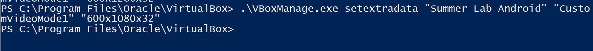

# Appendix: How to Create Prepared VMs for Labs \*

## Create a Ubuntu VM on VirtualBox

Download [`ubuntu-20.04.2.0-desktop-amd64.iso`](https://ubuntu.com/download/desktop/thank-you?version=20.04.2.0&architecture=amd64) image file from [Ubuntu official website](https://ubuntu.com/download/desktop)

Start VirtualBox, click `New` button to create an empty Ubuntu VM, assign dynamically hard disk storage to it (I set it as 30 GB) 


Run the newly created VM and select the image downloaded as the start-up disk.


### Install Wireshark


Start a terminal and run

```
sudo dpkg-reconfigure wireshark-common
```

select `yes` and confirm, then run

```
sudo adduser $USER wireshark
```

Restart or log out. When you come back to this VM, you can lanuch Wireshark without root priviledge.

### Install Docker (Optional) \*


### Lab 4

Install dependencies

```
$ sudo apt-get install git curl openssl lsb-release cmake wget python3-pip
```

Install Modules

```
$ pip3 install phe[cli] Pyfhel
```

Update the environment variable by:

```
$ sudo gedit ~/.bashrc
```

Append

```sh
export PATH=$HOME/.local/bin:${PATH}
export LD_LIBRARY_PATH="/usr/lib/x86_64-linux-gnu/:${LD_LIBRARY_PATH}"
```

to the end of the file.

### Lab 3

Clone `openabe`

```
git clone https://github.com/zeutro/openabe
```

Set `ZROOT` (otherwise, `bison` cannot be found during building)

```sh
export ZROOT=${HOME}/openabe 
```

In case it cannot fetch `gtest` by `curl`, run

```
sudo apt-get install ca-certificates
printf "\nca_directory=/etc/ssl/certs/" | sudo tee -a /etc/wgetrc
```

to add the CA certificates. Then open the directory and build `openabe`

```
cd openabe
sudo -E ./deps/install_pkgs.sh
. ./env
make
sudo -E make install
```

### Lab 7

Install Metasploit framework:

```
curl https://raw.githubusercontent.com/rapid7/metasploit-omnibus/master/config/templates/metasploit-framework-wrappers/msfupdate.erb > msfinstall
```

Install `adb`

```
sudo apt install adb
```

## Create an Android VM

Download [`android-x86_64-7.1-r5.iso`](https://osdn.net/projects/android-x86/downloads/67834/android-x86_64-7.1-r5.iso/) iamge from the [official website](https://www.android-x86.org/).


Choose dynamically allocated storage and allocate 10GB as its hard disk space.


Set its display and network:

- Display: Select `VBoxVGA` as graphics cotroller, check "enable 3D acceleration"
- Network: Attach to `NAT`, select adapter tye as `PCNet Fast III`, and check "Cable connected".


Start the VM, Load `android-x86_64-7.1-r5.iso` as start-up disk. 

Select "Advanced options" -> "Auto Installation" -> "Create/Modify partitions" -> "Run Android-x86"


After installing Android OS, it requires you set up some initial settings, you can simply skip it and use default settings.

After entering the home screen, check "Unknown source" in "Settings" -> "Secure" to allow you install `.apk` from Internet.

Open Chrome browser app on it, download `apk`s:

- For Lab 7: [Android Terminal Emulator](https://android-terminal-emulator.en.uptodown.com/android)
- For Lab 8: [SQL Inject Demo](https://github.com/li-xin-yi/SQL-inject-demo/releases/download/v0.0.4/sql-inject-demo.apk)
  
Choose "open" once finishing the download, it will ask you whether to install the downloaded `apk`s automatically, confirm and install them anyway.


Drog the two apps to the home screen, finally we get such an Android VM:


### Optional: Change the Screen Size \*

To make it looks more like a phone in portrait oriention mode, we may modify its 
screen resolution as `600*1080*32` and fit VirtualBox viewer. *(see [this video](https://www.youtube.com/watch?v=VHwOyrWodS4) as well)*

Find the location where `VirtulBox` installed on your Windows Desktop (`C:\Program Files\Oracle\VirtualBox` by default), check if `VBoxManage.exe` is there. If it is, start a command-line tool (e.g. PowerShell) in that directory and run:

```
.\VBoxManage.exe setextradata "Summer Lab Android" "CustomVideoMode1" "600x1080x32"
```



Enter "debug mode" when starting the VM, press <kbd>Enter</kbd> and waitting for the output stops. Then run

```
mount -o remount,rw /mnt
cd /mnt/grub
```

Modify `menu.lst` by

```
vi menu.lst
```

Add `vga=ask` (press <kbd>i</kbd> to insert) after first "quiet root=/dev/ram0" and save it (first <kdb>Esc</kbd> then type `:wq` and hit <kbd>Enter</kbd>).

Reboot:

```
reboot -f
```

It will ask you about which video mode to select each time you start the Android VM.


Select the last one (`360`) and you will enter a portrait screen:


If the VirtualBox window doesn't fit the screen you can modify the scale in View menu. Now you can also modify `menu.lst` with `VGA=864` (`360` is in hex-format, its dec value is `864`), after that it will become `600*1080*32` by default in case you are tired of choosing the screen resolution every time.


