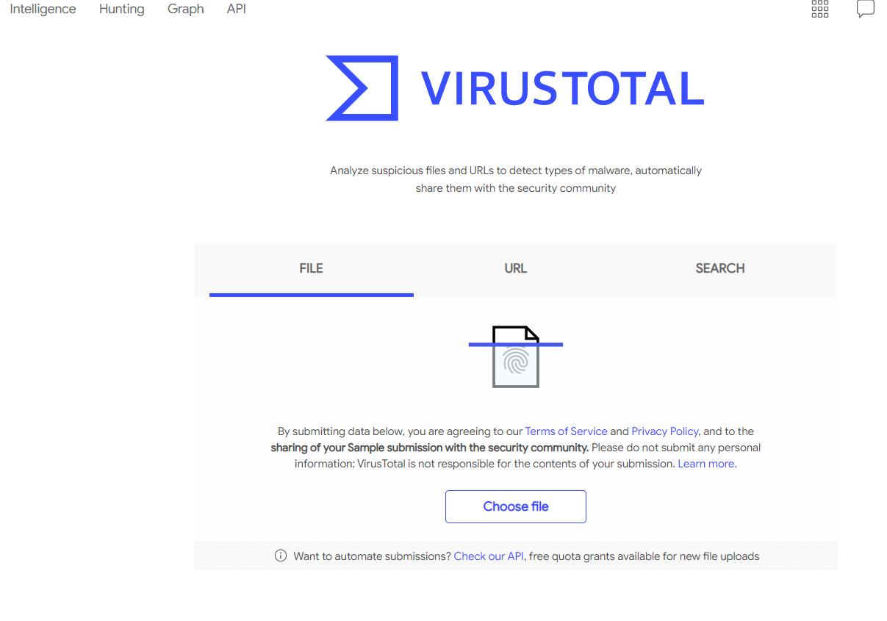

# Lab 6: Behavior-based Mobile Malware Analysis and Detection


 
## Set-up


`````{tabbed} FlowDroid

Install Dependencies:

```
$ sudo apt-get install openjdk-8-jdk openjdk-8-jre android-sdk
```

Find the SDK folder, it is usually located in `/usr/lib/android-sdk/`. Set it as an enviroment variable

```
export ANDROID_SDK=/usr/lib/android-sdk/
```

Download [`SourcesAndSinks.txt`](https://raw.githubusercontent.com/secure-software-engineering/FlowDroid/develop/soot-infoflow-android/SourcesAndSinks.txt) from DroidFlow project

```
wget https://raw.githubusercontent.com/secure-software-engineering/FlowDroid/develop/soot-infoflow-android/SourcesAndSinks.txt
```

**Install [FlowDroid](https://github.com/secure-software-engineering/FlowDroid)**

Download `soot-infoflow-cmd-jar-with-dependencies.jar`

```
$ wget https://github.com/secure-software-engineering/FlowDroid/releases/download/v2.8/soot-infoflow-cmd-jar-with-dependencies.jar
```

`````

`````{tabbed} Mobile Security Framework (MobSF)

If you have set-up Docker before, you can start it by pulling the image and running the container via Docker:

```
docker pull opensecurity/mobile-security-framework-mobsf
docker run -it --rm -p 8000:8000 opensecurity/mobile-security-framework-mobsf:latest
```

And then open the web-broswer to check the link [http://localhost:8000/](http://localhost:8000/).

Otherwise, if you don't want to run Docker on your local machine, you can open the URL: [https://labs.play-with-docker.com/?stack=https://raw.githubusercontent.com/MobSF/Mobile-Security-Framework-MobSF/master/scripts/stack/docker-compose.yml](https://labs.play-with-docker.com/?stack=https://raw.githubusercontent.com/MobSF/Mobile-Security-Framework-MobSF/master/scripts/stack/docker-compose.yml) to run the Docker container as a web application online.

```{warning}
You may be asked to sign up with a DockerHub account first. After you register the account, log in and click on "Start". 
```

```{warning}
When "Session stack builder" finishes, it says that "Your session is ready", then you can click on "CLOSE", if it doesn't work, just refresh the website.


```

Click on "8000" in this page:


And finally you can see such a web application on port 8000:


`````


## FlowDroid: Static Analysis

FlowDroid [^1] is a context-, flow-, field-, object-sensitive and lifecycle-aware static taint analysis tool for Android applications. It is based on [Soot](http://www.sable.mcgill.ca/soot/) and [Heros](http://sable.github.io/heros/). A very precise call-graph is used to ensure flow- and context-sensitivity. For the purpose of malware detection, FlowDroid statically computes **data-flows** in Android apps and Java programs, which is utilized to find out data leaks.

[^1]: Arzt, Steven, et al. "[Flowdroid: Precise context, flow, field, object-sensitive and lifecycle-aware taint analysis for android apps.](https://www.bodden.de/pubs/far+14flowdroid.pdf)" *Acm Sigplan Notices* 49.6 (2014): 259-269.

For example, [`Claco.A.apk`](https://github.com/ashishb/android-malware/tree/master/BreakBottleneck/SamplesOfHIP2014TalkBreakBottleneck/Claco.A) [^2] is an Android malicious app that steals text messages, contacts and all SD Card files, and it can also automatically execute downloaded `svchosts.exe` when the phone is connected to the PC in the USB drive emulation mode. `svchosts.exe` can record sounds around the infected PC and upload them to remote servers.

[^2]: See this slides: [Breaking through the bottleneck: Mobile malware is outbreak spreading like wildfire.](https://hackinparis.com/data/slides/2014/ThomasLeiWang.pdf)

Before running `FlowDroid` with downloaded `Claco.A.apk`, we must specify a  definition file for sources and sinks, which defines what use a default shall be treated as a source of sensitive information and what shall be treated as a sink that can possibly leak sensitive data to the outside world. `SourcesAndSinks.txt` provided by FlowDroid homepage demo is targeted on looking for privacy issues, we can apply it for our example to analyze the data-flow in `Claco.A.apk`:

```
$ java -jar soot-infoflow-cmd-jar-with-dependencies.jar -a Claco.A.apk -p $ANDROID_SDK/platforms/ -s SourcesAndSinks.txt
```

It will give a long report about the analysis result:


```
...
[main] INFO soot.jimple.infoflow.android.SetupApplication - Collecting callbacks and building a callgraph took 1 seconds
[main] INFO soot.jimple.infoflow.android.SetupApplication - Running data flow analysis on Claco.A.apk with 68 sources and 194 sinks...
...
[main] INFO soot.jimple.infoflow.android.SetupApplication$InPlaceInfoflow - Callgraph construction took 0 seconds
...
[main] INFO soot.jimple.infoflow.android.SetupApplication$InPlaceInfoflow - IFDS problem with 10212 forward and 4505 backward edges solved in 0 seconds, processing 14 results...
[main] INFO soot.jimple.infoflow.android.SetupApplication$InPlaceInfoflow - Current memory consumption: 249 MB
[main] INFO soot.jimple.infoflow.android.SetupApplication$InPlaceInfoflow - Memory consumption after cleanup: 35 MB
[main] INFO soot.jimple.infoflow.data.pathBuilders.BatchPathBuilder - Running path reconstruction batch 1 with 5 elements
[main] INFO soot.jimple.infoflow.data.pathBuilders.ContextSensitivePathBuilder - Obtainted 5 connections between sources and sinks
...
[main] INFO soot.jimple.infoflow.android.SetupApplication$InPlaceInfoflow - The sink virtualinvoke $r7.<java.io.FileOutputStream: void write(byte[])>($r8) in method <smart.apps.droidcleaner.Tools: boolean GetContacts(android.content.Context)> was called with values from the following sources:
...
[main] INFO soot.jimple.infoflow.android.SetupApplication$InPlaceInfoflow - - r5 = interfaceinvoke $r4.<android.database.Cursor: java.lang.String getString(int)>($i0) in method <smart.apps.droidcleaner.Tools: boolean GetContacts(android.content.Context)>
...
<smart.apps.droidcleaner.Tools: boolean GetAllSMS(android.content.Context)> was called with values from the following sources:
...
[main] INFO soot.jimple.infoflow.android.SetupApplication$InPlaceInfoflow - - $r9 = interfaceinvoke $r4.<android.database.Cursor: java.lang.String getString(int)>($i1) in method <smart.apps.droidcleaner.Tools: boolean GetAllSMS(android.content.Context)>
[main] INFO soot.jimple.infoflow.android.SetupApplication$InPlaceInfoflow - The sink virtualinvoke $r13.<java.io.DataOutputStream: void write(byte[],int,int)>(r5, 0, $i0) in method <smart.apps.droidcleaner.Tools: boolean UploadFile(java.lang.String,java.lang.String,java.lang.String,java.lang.String,android.content.Context)> was called with values from the following sources:
[main] INFO soot.jimple.infoflow.android.SetupApplication$InPlaceInfoflow - Data flow solver took 1 seconds. Maximum memory consumption: 249 MB
[main] INFO soot.jimple.infoflow.android.SetupApplication - Found 11 leaks
```

It first determines the sources and sinks in the decompiled codes according to `SourcesAndSinks.txt`, and then build a call-graph and construct path between sources and sinks. Finally it finds out some data-flows comes from identified sensitive sources but never go into any legal sinks, which means sensitive data leaks. For example, from the report above, method `GetContacts`, `GetAllSMS` and `UploadFile` are called with private data as context but data is then flow into somewhere not in defined sinks, which probably matches the behavior we describe above. Thus, `FlowDroid` can detect privacy leakage issues in this app. 

```{admonition} Deliverable 1
Can you run `FlowDroid` with a similar configuration to explore the privacy issue in the malware `reverse_tcp`, which you have created in previous Lab 7? And then describe what happens, is there any data leakage? If there is, point out which lines in the outputs helps you locate the data leakage?
```

````{admonition} Answer 1
---
class: hint
---

Run 
```
java -jar soot-infoflow-cmd-jar-with-dependencies.jar -a reverse_tcp.apk -p $ANDROID_SDK/platforms/ -s SourcesAndSinks.txt
```
Yes, there is one data leakage found in last few lines of the outputs:
```
...
[main] INFO soot.jimple.infoflow.android.SetupApplication$InPlaceInfoflow - The sink virtualinvoke $r19.<java.io.FileOutputStream: void write(byte[])>($r18) in method <com.metasploit.stage.Payload: void a(java.io.DataInputStream,java.io.OutputStream,java.lang.Object[])> was called with values from the following sources:
[main] INFO soot.jimple.infoflow.android.SetupApplication$InPlaceInfoflow - - $r17 = virtualinvoke $r22.<java.net.URLConnection: java.io.InputStream getInputStream()>() in method <com.metasploit.stage.Payload: void main(java.lang.String[])>
[main] INFO soot.jimple.infoflow.android.SetupApplication$InPlaceInfoflow - Data flow solver took 0 seconds. Maximum memory consumption: 50 MB
[main] INFO soot.jimple.infoflow.android.SetupApplication - Found 1 leaks
```
````

## MobSF: Static Analysis

[Mobile Security Framework (MobSF)](https://github.com/MobSF/Mobile-Security-Framework-MobSF) is an automated, all-in-one mobile application (Android/iOS/Windows) pen-testing, malware analysis and security assessment framework capable of performing static and dynamic analysis.

```{warning}
We will not build with the *dynamic analysis* feature in this lab for that the associated Android VMs cannot be simply configured in VMs and Docker containers. If you are still interested in this feature, read its [docs](https://mobsf.github.io/docs) or email us for help.
```

It runs as a web application that you can simply upload `.apk` files for a more comprehensive analysis. In the following of this section, we will domenstrate how to use it to detect malware.

For example, [`Dropdialer.apk`](https://github.com/ashishb/android-malware/blob/master/BreakBottleneck/SamplesOfHIP2014TalkBreakBottleneck/Dropdialer.A/Dropdialer.apk)[^2] guises as an app supposedly used to set wallpapers. However it downloads another file in the background. It then tricks users to install the downloaded file. 

We upload `Dropdialer.apk` via MobSF web interface, after it completely analyzes the `apk` file, we will immediately jump to a report page like:


Scroll down and pay attention to the Permission section:


Notice that it has a `WRITE_EXTERNAL_STORAGE` permission that allows an application to write to **external storage**, which enables the app downloads another app in the backgroud.

Then we move to the Code Analysis section, which lists some vulnerable codes:


The second item shows that a method in this app can write or read external storage by default permission. If we click on `com/nnew/superMariowallpapers/MarioHDWallpapersActivity.java`, it will jump to the vulnerable code location:


It is pretty obvious that it could read from some downloaded `apk` and `txt`. But when are those files downloaded?

See Quark Analysis in Malware Analysis section, it enumerates out all potential malicious behaviors in this app:


`com/nnew/superMariowallpapers/AlertActivity.smali -> download(Ljava/lang/String;Ljava/lang/String;)V` [^3] indicates most suspecious behaviors are defined in `download` method, which intends to download some files from external URLs:


If we continue to look at Server Location, Domain Malware Check and URLs sections, we can know more about the external link which the app send requests to:


The URL `http://dl.dropbox.com/u/87265868/srv.txt` with domain `dl.dropbox.com` has a geolocation listed above and still works now.

All the analysis results matches the malicious behaviors that `Dropdialer.apk` is designed for. 

[^3]: `.smali` is a human-readable dex format used in Android's Java VM implementation. But we do not recommend reading this low-level representation here. More information about it can be found in https://github.com/JesusFreke/smali

````{admonition} Deliverable 2
Please analyze the `reverse_tcp.apk` with MobSF and 

1. list out what dangerous permissions are required by this app? 
2. list out what potential malicious behavious may be perfomed by this app?
````

````{admonition} Answer 2
---
class: tip
---

1. `ACCESS_COARSE_LOCATION`, `ACCESS_FINE_LOCATION`, `CALL_PHONE`, `CAMERA`, `READ_CALL_LOG`, `READ_CONTACTS`, `READ_PHONE_STATE`, `READ_SMS`, `RECEIVE_SMS`, `RECORD_AUDIO`, `SEND_SMS`, `WRITE_CALL_LOG`, `WRITE_CONTACTS`, `WRITE_EXTERNAL_STORAGE`, `WRITE_SETTINGS`
2. 7 behaviors in QUARK ANALYSIS:
   - Acquire lock on Power Manager
   - Get absolute path of the file and store in string
   - Hide the current app's icon
   - Instantiate new object using reflection, possibly used for dexClassLoader
   - Load external class
   - Method reflection
   - Monitor the general action to be performed
````

## VirusTotal: Online Tool

Though FlowDroid and MosBF can detect some potential malicious codes by static analysis, many malicious behaviors still remain undetected before runtime. [VirusTotal](https://www.virustotal.com/gui/) is an online web application that aggregates many antivirus products and online scan engines to check for malicious behaviors in user's uploaded `apk` files. Besides, it also applies dynamic analysis for malwares using  Cuckoo sandbox.

````{warning}
You must first register an account on [virustotal](https://www.virustotal.com/) and log in, otherwise the dynamic analysis may not launch.
````

For example, [`Obad.A.apk`](https://github.com/ashishb/android-malware/raw/master/BreakBottleneck/SamplesOfHIP2014TalkBreakBottleneck/Obad.A/Obad.A.apk) [^2] is a sophisticated Android malware, it

-  sends SMS to premium-rate numbers;
-  downloads other malware programs, installs them on the infected device and/or
send them further via Bluetooth;
-  is remotely performed by commands in the console
-  is of highly complexity and exploits a number of unpublished vulnerabilities (at that time, 2014)

We open the VirusTotal offical website: [www.virustotal.com](https://www.virustotal.com/gui/home/upload) and upload `Obad.A.apk`



The result report comes up soon, it is definitely classified as malware by thoses scanners listed on Detection panel:


In Details panel, it also gives similar brief results with MobSF, let's skip it and move to Relation panel:


Because VirusTotal first calculate hash value and check if the app was uploaded by users before, if it was scanned before, it directly shows the existing results. We can see what domains or IP address the app contacted when it was executed in a sandbox. It also gives a graph summary about what files and addresses the app is related to when running:


For more detailed run-time behaviors of this app, we can move to Behaviors panel:


It recorded all network communications and file system actions, we also notice that the app executed very dangerous shell commands


By the way, you can also review the comments about this app, which are posted by other users in Community panel.

````{admonition} Deliverable 3
Please analyze `reverse_tcp` with VirusTotal and describe what IP address it will contact in runtime as well as other behaviors? Give a screenshoot.
````

````{admonition} Answer 3
---
class: tip
---
Actually, it depends.


````


