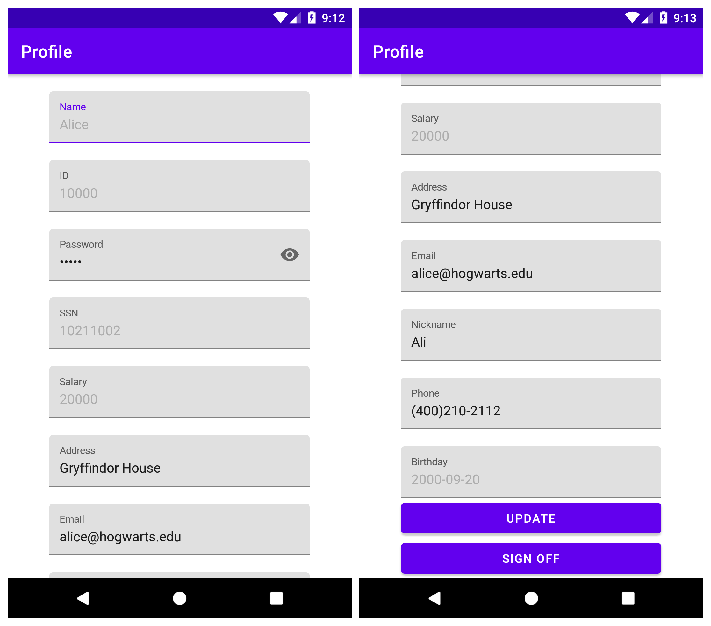
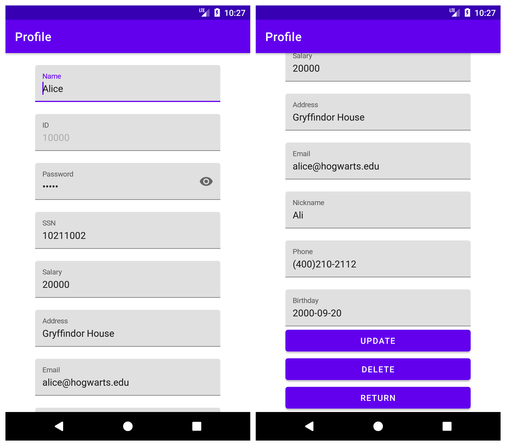
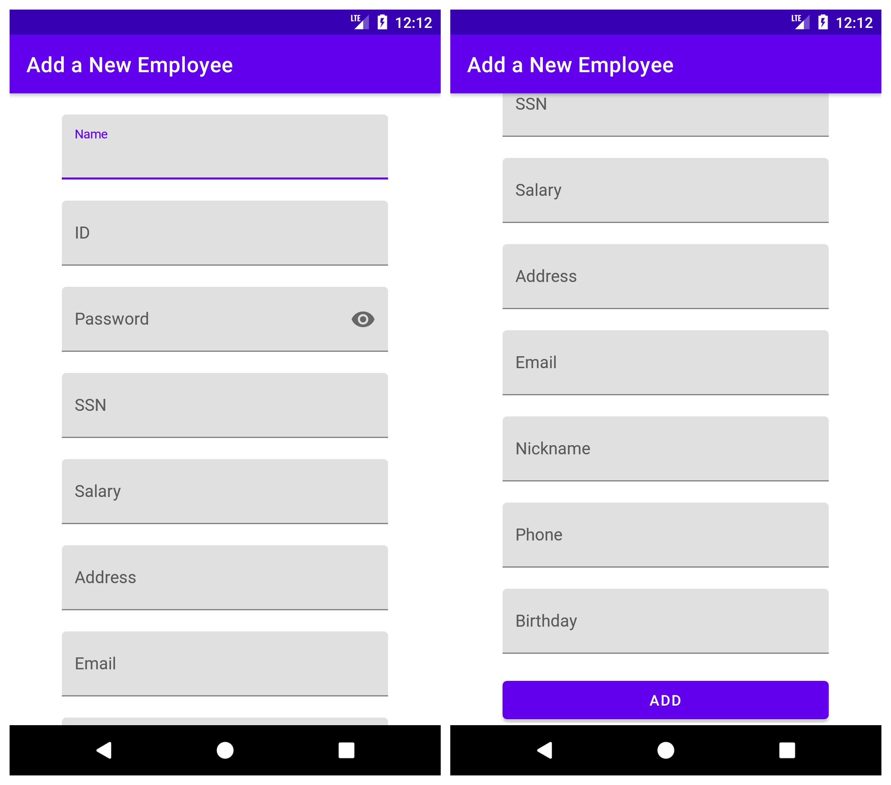

# Lab 8: Apps SQL Injection and Defense

SQL injection is basically a technique through which attackers can execute their own malicious SQL statements generally referred to malicious payload. Through the malicious SQL statements, attackers can steal information from the victim database; even worse, they may be able to make changes to the database. 

This lab is adapted from [SEED Labs – SQL Injection Attack Lab](https://seedsecuritylabs.org/Labs_16.04/Web/Web_SQL_Injection/). The major difference between this lab and the one in the SEED project is that: SEED lab explores the SQL Injection vulnerability of a remote web server and the attacker does SQL-inject attack via web application front-end input. In our lab, we store all user data of a mobile app in a local database for simplicity. All operations will be demonstrated on an android platform.

## Set-up

We adopt an android app named `SQL Inject Demo` ({download}`sql-inject-demo.apk`, source code available [li-xin-yi/sql_inject_demo](https://github.com/li-xin-yi/sql_inject_demo)) as our main environment. It should be installed on an android physical/virtual machine with API >= 17 (Android >= 4.2). We recommend a virtual machine of SDK API 25, which can be easily set-up either via [AVD manager integrated in Android Studio](https://developer.android.com/studio/run/emulator) or [SeedLab virtual machine on VirtualBox](https://seedsecuritylabs.org/Labs_16.04/Mobile/SEEDAndroid_VirtualBox.pdf).

## Task 0: Get familiar to the App

This app uses an SQLite database to simulate an employee management system. After installed on your phone and sign in it first time, it initializes a database `employeeDB.db`, which contains only one table `employee` as:

ID | Name | Password |  SSN | Salary | Nickname | Phone | Email | Address | Birthday
---|---|---|---|---|---|---|---|---|---|
99999 | Admin | admin | 43254314 | 400000 | Admin | (403) 220-1191 | admin@hogwarts.edu | Gryffindor House | 1990-03-05
10000 | Alice | alice | 10211002 | 20000 | Alice | (400)210-2112 | alice@hogwarts.edu | Gryffindor House | 2000-09-20
20000 | Bobby | bobby | 10213352 | 50000 | Bob | (404) 789-2313 | boby@hogwarts.edu | Hufflepuff House | 2000-04-20
30000 | Ryan | ryan | 32193525 | 90000|  Ryanny | (210) 096-3287 | ryan@hogwarts.edu | Ravenclaw House | 2000-04-10
40000 | Sammy | sammy | 32111111 | 40000 | Sam | (450) 218-8876 | samy@hogwarts.edu | Slytherin House | 2000-01-11 
50000 | Ted | ted | 24343244 | 110000 | Teddy | (208) 222-8712 | ted@hogwarts.edu | Azkaban | 2000-11-03

Whenever you want to reset the database as above, uninstall the app and reinstall it or tap on the RESET button.

When you open it, you will first be asked to login. Just pick one of the users (e.g. username: `Alice`, password `alice`). If you type an incorrect username or password, you cannot access the system:


If you log in the system as a normal user (i.e. not Admin), you will enter your own profile page. Meanwhile, you can edit some fields (Nickname, Password, Address, Phone, and Email) and tap the "UPDATE" button to update your profile.



However, as a normal user, you cannot modify your ID, Name, SSN, Salary, Birthday or any information of other users.

if you log in with Admin account, you will  enter a manage view and see all employees' personal information in the database:


When tapping on any item in this page, you will jump to a profile page similar to the one we previously saw, except that you can now modify any field of this user, excluding ID.



Moreover, you can delete the information of a certain employee and add a new employee by clicking on the "+" button on the "All employees" view as well. Note that we might not use any functionalities of Admin add/delete/update in the following tasks, but by using the data interface, you can explore the vulnerabilities with custom data in a more flexible way.



Even if you exit from the app, all updated data will be stored in the database. Whenever you open the app again, the user data will look like what you last modified.


## Task 1: SQL Injection Attack on SELECT Statement

```{warning}
Suppose that from now on, we don't know the password of any user.
```


A typical vulnerable login page takes user input as arguments of [where clause](https://www.sqlitetutorial.net/sqlite-where/) to construct an SQL select query, if the database responds to the query with at least one valid result, the user can be authenticated. For example, this code snippet reveals how our app design for authentication:


```{code-block} java
---
linenos:
emphasize-lines: 6-7
---
public Employee findHandler(String username, String password) {
    String query;
    Cursor cursor;
    SQLiteDatabase db = this.getReadableDatabase();
    Employee employee = null;
    query = "SELECT * FROM " + TABLE_NAME + " WHERE NAME='" + username + "' AND PASSWORD='" + password + "'";
    cursor = db.rawQuery(query, null);
    if (cursor != null && cursor.getCount() > 0 && cursor.moveToFirst()) {
        employee = new Employee(Integer.parseInt(cursor.getString(0)),
                cursor.getString(1),
                cursor.getString(2),
                cursor.getString(3),
                cursor.getString(4),
                cursor.getString(5),
                cursor.getString(6),
                cursor.getString(7),
                Integer.parseInt(cursor.getString(8)),
                cursor.getString(9)
        );
        cursor.close();
    }
    db.close();
    return employee;
}
```

As we have no knowledge about any password, we have to construct a payload to avoid the check of 

```
" WHERE NAME='" + username + "' AND PASSWORD='" + password + "'"
```

Assume we want to login as an Admin account because it has more privileges

`````{tabbed} Solution 1
- Username: `Admin' --`
- Password: `xyz` (You can replace it with any non-empty text)

It constructs the SQL query as:

```sql
SELECT * FROM employee WHERE NAME='Admin' -- AND PASSWORD = 'xyz'
```

`--` serves as a start symbol of an in-line comment, so `AND PASSWORD = 'xyz'` will be regarded as just comments and **the validity of password will never be checked**.

```{warning}
The in-line command symbol `#` in MYSQL cannot be recongized in SQLite, a payload with `#` may lead the app to crash.
```
`````

`````{tabbed} Solution 2
- Username: `Admin`
- Password: `anytext' OR '1'='1`

It will result in an SQL query as:

```sql
SELECT * FROM employee WHERE NAME='Admin' AND PASSWORD = 'anytext' OR '1'='1'
```

`````

### Task 1.1: Append a new SQL statement

We may not be satisfied with only bypassing authentication and stealing information. It will be better if we can append a new SQL statement right after the supposed SQL query to modify the database. 

Usually, a semicolon (`;`) is used to separate two SQL statements. So what if we append a INSERT statement when login the system? For example,

- username: `a' OR 1=1; INSERT INTO employee (NAME, ID) VALUES ('MUR','11451') --`
- password: `anything`

Unfortunately, although we can pass the login page by the injection code, no new data will be inserted into the database. Because `;` is defined as a termination in most [SQLiteDatabase API](https://developer.android.com/reference/android/database/sqlite/SQLiteDatabase.html#execSQL(java.lang.String)), anything after it should be ignored, which means it does not support multiple statements in a single query. [^1]

[^1]: More information can be referenced [in this question](https://stackoverflow.com/questions/13202600/android-and-sqlite-when-to-use-semicolons-to-end-statements)

## Task 2: SQL Injection Attack on UPDATE Statement

If an SQL injection vulnerability happens to an UPDATE statement, the damage can be more severe because attackers can use the vulnerability to modify databases.

```{warning}
Suppose that from now on, we only know the password of a normal user. (e.g. Alice)
```

The typical vulnerable update page takes the user's inputs and constructs a UPDATE statement. For example, in our app, a profile update request by normal user is handled by the following code snippet:

```java
public void partialUpdateHandler(Employee employee) {
    // invoked by user, update some optional fields
    String UPDATE_SQL_COMMAND = String.format("UPDATE %s SET NICKNAME='%s', EMAIL='%s', ADDRESS='%s', PASSWORD='%s', PHONE='%s' WHERE ID=%s",
            TABLE_NAME,
            employee.getNickname(),
            employee.getEmail(),
            employee.getAddress(),
            employee.getPassword(),
            employee.getPhone(),
            employee.getId());
    SQLiteDatabase db = this.getWritableDatabase();
    db.execSQL(UPDATE_SQL_COMMAND);
}
```


### Task 2.1

As we all know that a normal user cannot modify his/her own salary, however, from the code snippet above, Alice can edit her profile by changing Phone as

```
00000', SALARY = '9990000
```

to send an UPDATE request as:

```sql
UPDATE employee SET NICKNAME=..., EMAIL =..., ADDRESS=..., PASSWORD =..,               PHONE='00000', SALARY='999000'
WHERE ID = (Alice.id)
```

### Task 2.2

Moveover, Alice can continue to change the salary of Boby by setting her own Phone as

```
00000', SALARY=0 WHERE NAME='Boby' --
```

Because it constructs:

```sql
UPDATE employee SET NICKNAME=..., EMAIL =..., ADDRESS=..., PASSWORD =..,               PHONE='00000', SALARY=0
WHERE NAME = 'Boby' -- ' WHERE ID = (Alice.id)
```


It all works when we login with Admin to check:


## Mitigation

From the tasks above, we can see what damage a poorly designed query handler for SQL server can cause. Fortunately, it is hard for an adversary to see the code snippet of retrieving SQL query in a real-word application. However, it is still vulnerable to build query statements by simply joining all arguments like before, as hackers still can explore all possible injection code by empirically enumerating them out. The best way to prevent them from injecting unsolicited SQL syntax into any query is to avoid using a completely constructed raw query in `rawQuery`. Instead, we can use a *parameterized/prepared statement*, such as SQLiteStatement, which offers both *binding* and *escaping* of arguments.

For example, we can replace the code from line 6-7 in `findHandler` with

```java
query = "SELECT * FROM "+ TABLE_NAME + " WHERE NAME=? AND PASSWORD=?";
cursor = db.rawQuery(query, new String[]{username,password});
```

and rewrite `partialUpdateHandler` method in a safe way:

```java
public boolean safePartialUpdateHandler(Employee employee)
{
    SQLiteDatabase db = this.getWritableDatabase();
    ContentValues values = new ContentValues();
    values.put("PASSWORD", employee.getPassword());
    values.put("NICKNAME", employee.getNickname());
    values.put("PHONE", employee.getPhone());
    values.put("ADDRESS", employee.getAddress());
    values.put("EMAIL", employee.getEmail());
    return -1!=db.update(TABLE_NAME,values,"ID=?", new String[]{String.valueOf(employee.getId())});
}
```

The question mark `?` is a parameter holder in a SQL query, which is to be compiled with the according argument given in the String ListArray. Both safe and unsafe versions of SQL operation are listed in source code ([`DBHandler.java`](https://github.com/li-xin-yi/SQL-inject-demo/blob/main/app/src/main/java/com/example/sql_inject_demo/DBHandler.java)).

When we include the alternatives in the app, you just need to turn on the "Safe Mode" switch when logging in, and repeat the tasks above. What will happen?

More categories of attacks and defenses [^2] are left for students interested in to read and test on this app.

[^2]: Alwan, Zainab S., and Manal F. Younis. "[Detection and prevention of sql injection attack: A survey.](https://www.researchgate.net/profile/Zainab-Alwan-5/publication/320108029_Detection_and_Prevention_of_SQL_Injection_Attack_A_Survey/links/59ce63840f7e9b4fd7e1b495/Detection-and-Prevention-of-SQL-Injection-Attack-A-Survey.pdf)" *International Journal of Computer Science and Mobile Computing* 6, no. 8 (2017): 5-17.