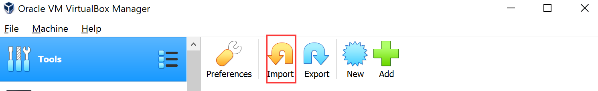
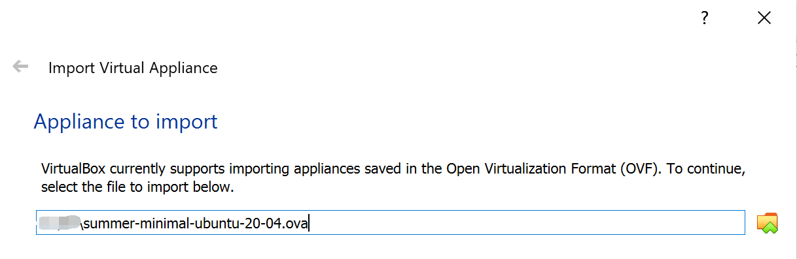
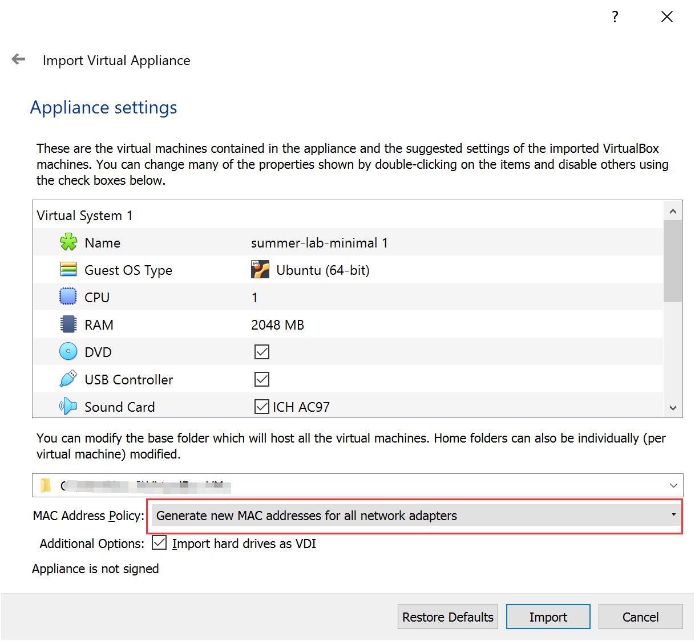
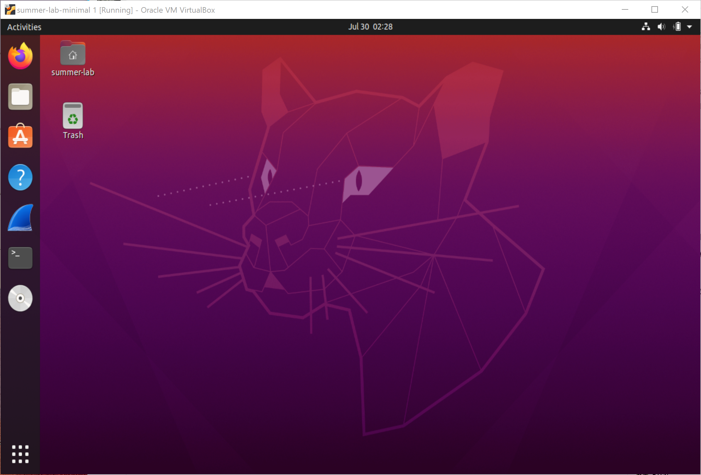
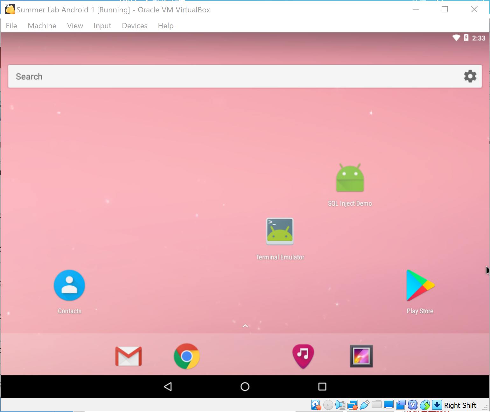
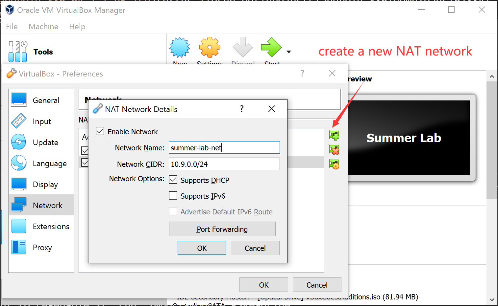
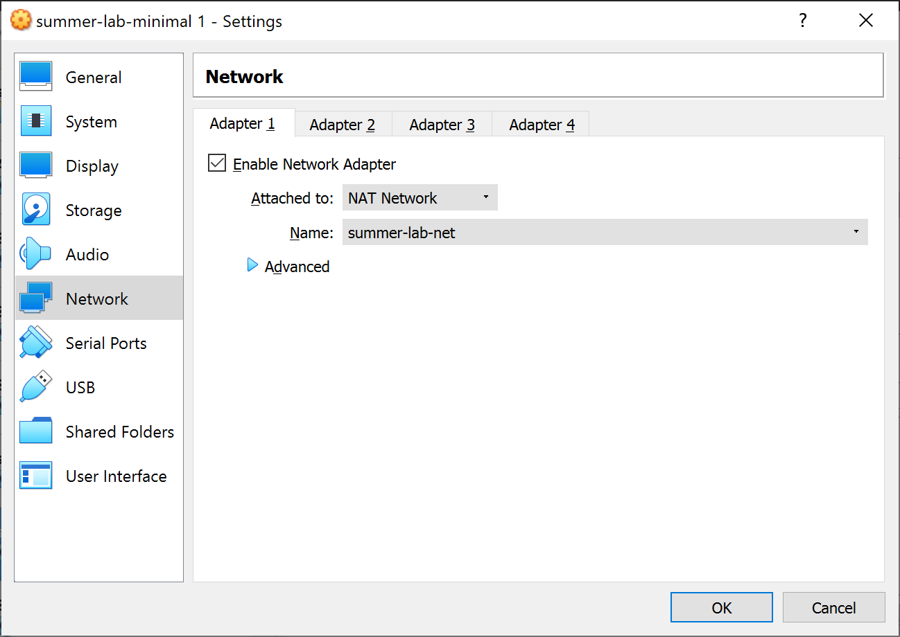

# Get Start

```{note}
In this manual, we focus on how to set up a minimal virtual environment for labs. The lab environments consist of a Ubuntu 20.04 VM (for Lab 3, 4, 6, and 7) and an Android 7.1.1 VM (for Lab 7 and 8). Dependencies for each lab are pre-built in seperate docker containers. To finish our labs, VMs should be installed on [VirtualBox](https://www.virtualbox.org/) and set in one single subnet.
```

Download Link: [Dropbox](https://www.dropbox.com/sh/qyve837b4blw2pv/AABnsknKTYFB_yY6qbHKnChta?dl=0) | [Google Drive](https://drive.google.com/drive/folders/1R91YJqPaLiK6xDZp5cD5-Y5jkjj6-z-R?usp=sharing)


You should first install  [VirtualBox](https://www.virtualbox.org/) and Extract `.ova` files for the two VMs from the downloaded `.zip` files. After extracted, the file size:

- `summer-minimal-ubuntu-20-04.ova`: \~ 4.8 GB
- `summer-android-7-1-1.ova`: \~ 1.9 GB
  
## Set up Ubuntu 20.04

### Account Information of this VM

- User name: `summer-lab`
- Password: `summer`

### Create a New VM in VirtualBox

Click on "Import" Button on VirtualBox GUI



Select the `summer-minimal-ubuntu-20-04.ova`:



Choose a folder as the base folder and name the VM on your own, select "Generate new MAC addresses for all network adapters" and then confirm "Import"



After that, you can click on the virtual machine to start it and log in, we will get a VM like:



## Set up Android 7.1.1


Similarly, we import `summer-android-7-1-1.ova` following the instructions above. Finally we will get a VM like:



## Configure Network

For Lab 7, we need to keep the two VMs in the same subnet. Here we use a network adapter called "NAT network", which works in a similar way to "local area network" or LAN. It enable VMs communication within same local network as well as the communication to the internet. All the communication goes through this single adapter.

To create such a NAT network of `10.9.0.0/24`, Choose "File -> Preferences" on VirtulBox menu, Select "Network" pannel and click on the "+" button on the left side. Name your network (e.g. `summer-lab-net` here) and fill out the Network CIDR as your expected subnet range. Select "Supports DHCP" if your want VMs allocated with dynamic IP addresses.



Then, we attach the two VMs to this NAT network. Right click on the labels of your imported VM on Virtual Box, select "Settings", go to its network panel, select "NAT network" in "Attach to" option and the name of created network in "Name" option.



Now, you have attached it to the subnet.

## Docker

```{note}
We use Docker images as pre-built lab environment for different labs, which provides an isolated virtual environment from the host Ubuntun 20.04 VM. Usually, it is enought to follow the set-up instructions in the very begining of each lab to use the Docker container. Here is also a cheatsheet of common Docker commands in case you come across some unexpected situatios.
```

List all running containers:

```
$ docker ps
```

You can use only the first few letters as a short reference of this container in `CONTAINER ID` field of the outputs. For example, your can kill it by `docker kill <short-id>`

List all containers (including exited ones):

```
$ docker ps -a
```

Kill all running containers:

```
$ docker container kill $(docker ps -q) 
```

Remove all exited docker containers:

```
$ docker rm $(docker ps -qa --no-trunc --filter "status=exited")
```

List all local images

```
$ docker images
```

Remove all local images (it is useful when you feel the disk is used up due to pulled images):

```
$ docker rmi $(docker images -a -q)
```

Open a shell on a running container named `container-name`

```
$ docker exec -it container-name /bin/bash
```


